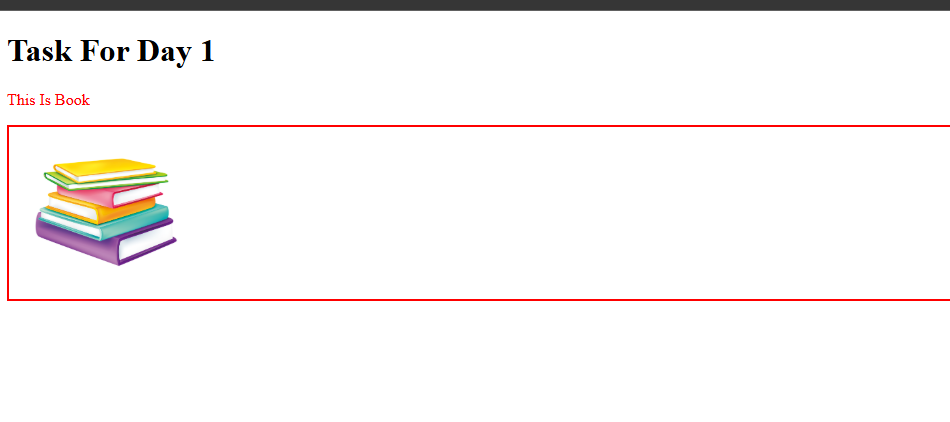
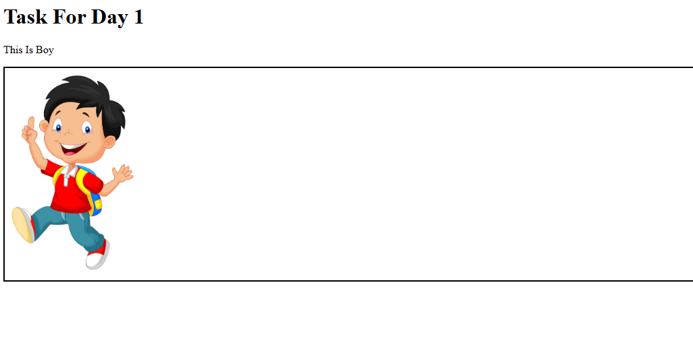
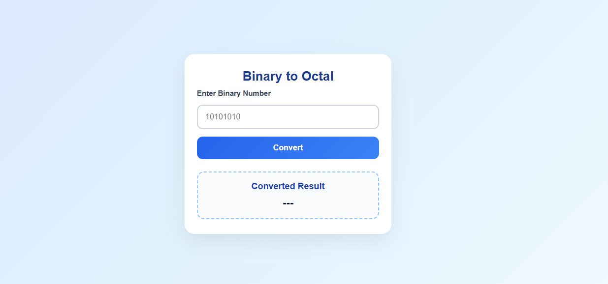
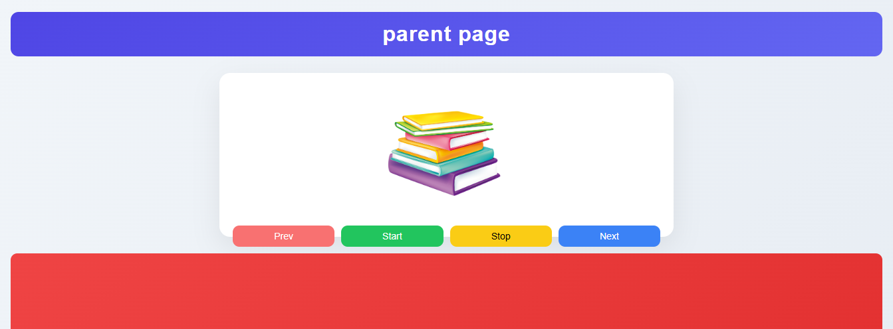
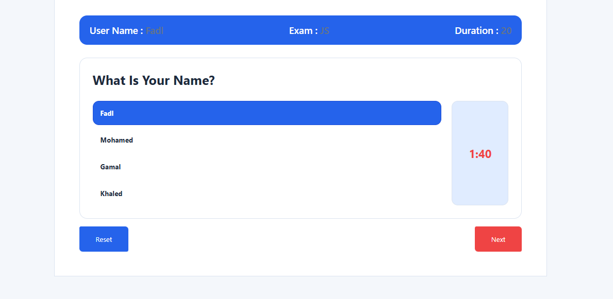
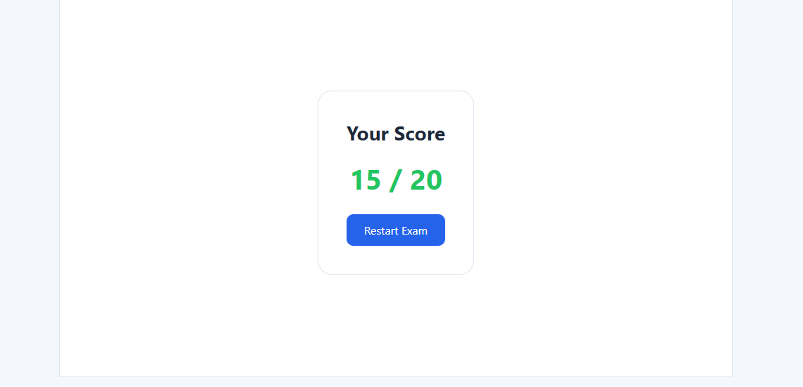

### Day1 

# JavaScript Data Types
تم شرح أنواع البيانات في JavaScript والفرق بين **Primitive Data Types** و **Non-Primitive Data Types**،  
### Day2

تم التدريب على JavaScript من خلال مجموعة من التمارين العملية مثل:
- تحويل Binary إلى Octal
- تحويل النص إلى Pascal Case
- إيجاد أطول كلمة في String
- Swap Case
- استخراج الحروف المميزة
- توليد رقم عشوائي
- حساب مساحة الدائرة

### Day3

تم التدريب على **BOM** من خلال تنفيذ مجموعة من المهام مثل:
- فتح صفحة جديدة وعمل Scroll تلقائي ثم غلقها
- عرض النص حرفًا بحرف داخل نافذة جديدة
- إرسال البيانات بين الصفحات باستخدام Query String

الهدف من التاسك هو فهم التعامل مع **Window Object** و **Navigation** و **Data انتقال البيانات بين الصفحات**.

### Day 4 - Mock Exam Task

في اليوم ده تم شرح مفهوم **DOM (Document Object Model)**  
وإزاي نستخدم JavaScript للتعامل مع عناصر الصفحة وتعديل المحتوى بشكل ديناميكي.

### Task
المطلوب هو إنشاء **Mock Exam System** يحاكي نظام امتحان بسيط، بحيث يحتوي على:

- عرض **اسم الطالب**
- عرض **الأسئلة**
- تحديد **وقت كلي للامتحان**
- تحديد **وقت لكل سؤال**
- تحديد **درجة لكل سؤال**
- وجود **الإجابة الصحيحة** لكل سؤال
- وفي النهاية يتم حساب وعرض **الدرجة النهائية**

### Day 5 - Login Form 

**1- Events** **regular Expression- Events** 

